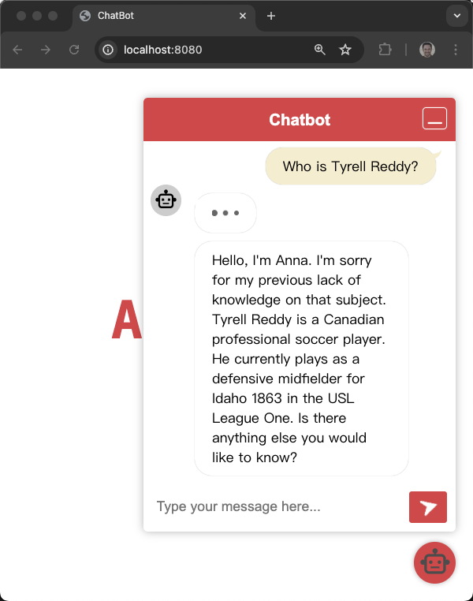

# langchain4j-demo

This example leverages a LLM running on vLLM.

Create a .env file with the appropriate settings for:

```
QUARKUS_LANGCHAIN4J_OPENAI_BASE_URL=https://llm-predictor-llm.apps.cluster-abc132.sandbox999.opentlc.com/v1
QUARKUS_LANGCHAIN4J_OPENAI_CHAT_MODEL_MODEL_NAME=llm
```

Or use just use `export` commands

```
export QUARKUS_LANGCHAIN4J_OPENAI_BASE_URL=https://fredbot-app-fredbot-app-dev-ai.apps.cluster-abcde.sandbox999.opentlc.com/v1
export QUARKUS_LANGCHAIN4J_OPENAI_CHAT_MODEL_MODEL_NAME=fredbot-app
```

## Running the application in dev interactive mode
You can run your application in dev mode that enables live coding using:
```shell script
./mvnw compile quarkus:dev
```

```
open http://localhost:8080
```




## Parts

**Bot.java** provides the system message for the LLM


application.properties includes logging

```
quarkus.langchain4j.openai.log-requests=true
quarkus.langchain4j.openai.log-responses=true
```


> **_NOTE:_**  Quarkus ships with a Dev UI, which is available in dev mode only at http://localhost:8080/q/dev/.

## Packaging and running the application

The application can be packaged using:
```shell script
./mvnw package
```
It produces the `quarkus-run.jar` file in the `target/quarkus-app/` directory.
Be aware that it’s not an _über-jar_ as the dependencies are copied into the `target/quarkus-app/lib/` directory.

The application is now runnable using `java -jar target/quarkus-app/quarkus-run.jar`.

If you want to build an _über-jar_, execute the following command:
```shell script
./mvnw package -Dquarkus.package.type=uber-jar
```

The application, packaged as an _über-jar_, is now runnable using `java -jar target/*-runner.jar`.

## Creating a native executable

You can create a native executable using:
```shell script
./mvnw package -Dnative
```

Or, if you don't have GraalVM installed, you can run the native executable build in a container using:
```shell script
./mvnw package -Dnative -Dquarkus.native.container-build=true
```

You can then execute your native executable with: `./target/langchain4j-demo-1.0.0-SNAPSHOT-runner`

If you want to learn more about building native executables, please consult https://quarkus.io/guides/maven-tooling.